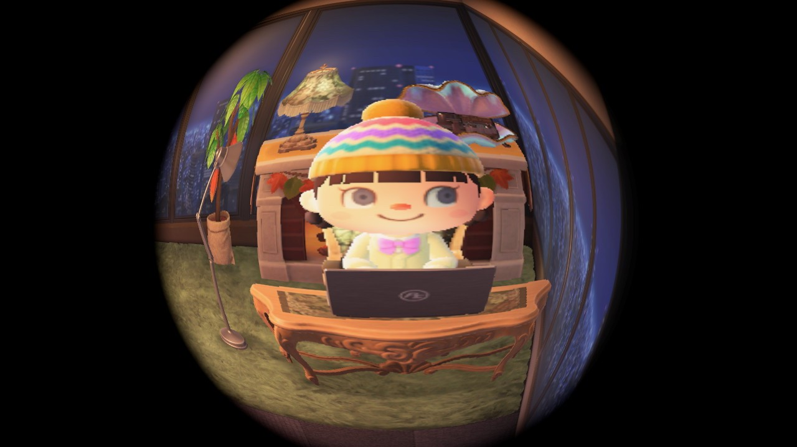

# 윤자현

  

1. 
   
   

2. 98년생, 범띠

3. 3월 23일생

4. ENFP

5. 전기 디스플레이반도체 전공

6. 현재 동래에서 통학 중 넘 힘들어서 자취방 구할 예정

7. 좋아하는 색 : 노란색

8. 최애 노래 : lauv - never not

9. 음악 취향 : 인디, 잔잔해서 잠 올 것 같은 노래

10. 취미 : 사진찍기, 닌텐도 동물의 숲

11. 좋아하는 캐릭터 : 동물의 숲 히죽이
    
    1. 
    
    2. 영어이름 : bob
    
    3. 취미 : 뛰어다니기
    
    4. 좋은 이유 :눈웃음 쩐다

12. 이가영과 동반 입과 성공
    
    1. 98년생, 범띠
    
    2. 9월 18일생
    
    3. ISFJ
    
    4. 아랍어 전공
    
    5. 동래 통학하다 혼자 자취해버림;
    
    6. 좋아하는 색 : 파란색
    
    7. 남자친구 없음
    
    8. 내 옆자리임
    
    9. 전화번호 궁금하면 저에게 mm주세요
    
    10. 음악취향 : 똥똥똥똥하면서 청량한 노래
